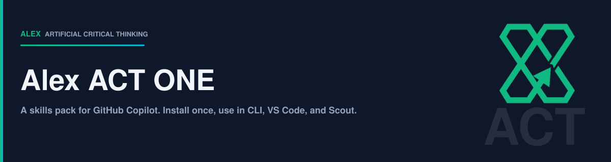

# Alex ACT ONE



A skills pack for GitHub Copilot. It covers how to think through a problem, how
to write code and prose that hold up, and how to produce documents and charts
worth sending to someone.

Install it once at the user level. Copilot CLI, VS Code, and Microsoft Scout all
read the same installation.

**Status:** In development. Not yet published to the Alex ACT Mall.

## What You Can Do With It

**Think before building.** Frame the real problem, weigh competing explanations,
name what would prove you wrong, and check a decision against its risks before
committing to it.

**Write code that survives review.** Test-first workflows, root-cause debugging,
security hardening, adversarial code review from three opposing perspectives, and
safe Git practice with recovery paths.

**Produce prose people finish reading.** Strip AI writing patterns, find the one
sentence a document is actually making, adapt a draft for a named audience, and
write Markdown that passes lint on the first attempt.

**Turn drafts into deliverables.** Convert between Markdown, Word, HTML, plain
text, and formatted email. Build charts, diagrams, print-quality figures, and
banners, then check that what rendered says what you meant.

**Improve the agent itself.** Audit which instructions earn their context cost,
write project-specific skills from work you keep repeating, and consolidate what
a session learned into something reusable.

59 skills, 15 always-on instructions, and 16 slash commands.

## The Skills

Grouped by what you are trying to do. The **Needs** column lists anything beyond
Node — most skills need nothing, and a skill only appears there if it genuinely
cannot run without that dependency. See [Optional extras](#3-optional-extra-tools-for-a-few-skills)
for how to get them.

<!-- BEGIN GENERATED SKILL TABLE -->

### Reasoning and judgment

How to think through a problem before acting on it.

| Skill | What it does | Needs |
| --- | --- | --- |
| `act-tenets` | The 10 canonical tenets of Artificial Critical Thinking (ACT) with rationale for each | — |
| `critical-thinking` | Challenge what you think is right — alternative hypotheses, missing data, evidence quality, bias detection,… | — |
| `problem-framing-audit` | Step-back protocol — restate, generalize, specialize, invert, ask why, pre-mortem, check stakeholders, and audit… | — |
| `adversarial-review` | Structured skepticism for high-stakes decisions and reviews | — |
| `deep-review` | Adversarial code review with three parallel perspectives — Advocate, Skeptic, Architect — that create productive… | — |
| `anti-hallucination` | Prevent fabricated facts, invented APIs, and citation confabulation at the point of generation | — |
| `risk-analysis` | Probability × impact risk assessment for curation and planning decisions | — |
| `ethical-reasoning` | Reason through ethical tensions using moral foundations, constitutional principles, and a five-step decision… | — |
| `mutation-testing` | Meta-test your test harness — apply small intentional defects to production code, expect the suite to catch each… | — |

### Engineering

Writing and changing code that survives review.

| Skill | What it does | Needs |
| --- | --- | --- |
| `code-review` | Systematic code review for correctness, security, and growth — not just style enforcement | — |
| `security-and-hardening` | Hardens code against vulnerabilities | — |
| `test-driven-development` | Use for any feature, bug fix, refactor, or behavior change — enforces RED-GREEN-REFACTOR | — |
| `systematic-debugging` | Use when encountering any bug, test failure, or unexpected behavior, before proposing fixes | — |
| `git-workflow` | Apply consistent git practices for branch hygiene, safe commits, and recovery from common mishaps (lost commits,… | — |
| `plan` | Use when the user wants a plan instead of execution, or before any non-trivial implementation (multi-file,… | — |
| `spike` | Use when the user wants to feel out an idea before committing to a real build | — |

### Prose and documentation

Writing people finish reading.

| Skill | What it does | Needs |
| --- | --- | --- |
| `big-idea` | Distill the central claim before authoring any summary-shaped output: hero copy, commit-message subject, PR title,… | — |
| `humanizer` | Use when the user wants to humanize, de-AI, de-slop, or un-ChatGPT a piece of text | — |
| `communication-craft` | Communication patterns for feedback, cross-audience content, and eliciting needs | — |
| `doc-hygiene` | Documentation hygiene — anti-drift rules, code-documentation placement, count elimination, and living document… | — |
| `lint-clean-markdown` | Write markdown that passes markdownlint on first attempt — encode the most common rules as muscle memory | — |
| `status-reporting` | Create stakeholder-friendly project status updates and progress reports | — |
| `markdown-sanitization-chain` | Render user-supplied markdown safely — marked.js → DOMPurify → Mermaid (order matters; skipping the sanitizer is… | — |
| `corpus-qa-sweep` | Run a QA sweep across an entire corpus instead of one sample: instrument the real output boundary, assert… | — |

### Charts and figures

Deciding what to draw, drawing it, and checking it says what you meant.

| Skill | What it does | Needs |
| --- | --- | --- |
| `chart-big-idea` | Distill the one-sentence Big Idea, story arc, audience, and style stance for a chart BEFORE picking a chart type | — |
| `chart-vocabulary` | Catalog of chart types organized by seven communication goals (comparison, change over time, proportion,… | — |
| `chart-interpretation` | Read a chart someone else made — image, screenshot, HTML, or dashboard — and extract insights, patterns,… | — |
| `flint-chart` | Use when the user wants to visualize data — from 'which chart should I use?' to 'render this' | Flint MCP |
| `flint-theme` | Creates and refines reusable Flint ThemeSpec visual systems from brand guidance, websites, decks, design tokens,… | Flint MCP |
| `ascii-chart` | Render charts and compact dashboards as pure ASCII in a monospace grid: bar, dot, sparkline, histogram, box plot,… | — |
| `print-svg-style-guide` | Author print-quality SVG figures for books, reports, and exec-facing documents: canvas and typography grammar with… | — |
| `figure-generator` | Ship deterministic hand-authored SVG generators for print-quality figures backed by real published datasets | — |
| `svg-banner` | Generate 1200x320 SVG banners for READMEs, plans, notes, and release artifacts, using a pluggable brand config… | — |
| `markdown-mermaid` | Author Mermaid diagrams that render correctly in GitHub, VS Code, and Mermaid 10+ consumers | — |
| `annotate-screenshot` | Add callouts to a raster you did not author, using Pillow, at a resolution that stays legible | Pillow |
| `render-verify` | Verify a rendered visual artifact actually says what it was supposed to say | — |
| `replicate-imagery` | Route AI image generation and editing requests to Replicate (FLUX, Ideogram, Recraft, SDXL, imagen) via the… | Replicate MCP |
| `docs-shell` | The single-page HTML shell (index.html + manifest.json at a repository root or stable subfolder) that renders… | — |

### Document conversion

Moving a document between formats without losing its structure.

| Skill | What it does | Needs |
| --- | --- | --- |
| `docx-to-md` | Convert Word documents (.docx) to clean Markdown with image extraction and pandoc cleanup | Pandoc |
| `html-to-md` | Convert HTML documents to clean Markdown via pandoc | Pandoc |
| `md-to-html` | Convert Markdown to standalone HTML pages with embedded CSS, images, and Mermaid diagrams | Pandoc |
| `md-to-word` | Convert Markdown with Mermaid diagrams and SVG illustrations to professional Word documents | Pandoc |
| `md-to-eml` | Convert Markdown to RFC 5322 email (.eml) with inline CSS and CID images | Pandoc |
| `md-to-txt` | Strip Markdown formatting and produce clean plain text via pandoc | Pandoc |
| `rich-email` | Create and validate polished HTML email drafts from Markdown, then open an unsent New Outlook draft on Windows | Pandoc |

### Working on the agent itself

Auditing, extending, and consolidating the agent.

| Skill | What it does | Needs |
| --- | --- | --- |
| `meditation` | Consolidate session learning into permanent architecture — extract patterns into skills, instructions, prompts,… | — |
| `compile-brain` | Create or improve a Markdown instruction, skill, prompt, or agent from an explicitly selected file or… | — |
| `assess-brain` | Assess active Markdown brain files in a local AI agent project or plugin source without changing it | — |
| `project-capability-authoring` | Create tested project-local skills and scripts from demonstrated repeated work | — |
| `token-waste-elimination` | Audit active brain artifacts for context cost, duplicated guidance, oversized routing files, and stale metadata | — |
| `proactive-awareness` | Applies cross-session context recovery, uncommitted-work detection, and focus routing once proactive behavior has… | — |

### Setup and platform

Getting the plugin and its dependencies working.

| Skill | What it does | Needs |
| --- | --- | --- |
| `bootstrap-core` | Activates, verifies, repairs, or removes this plugin's 15 user-scope runtime instructions from canonical installed… | — |
| `bootstrap-project` | Previews and applies this plugin's repository scaffold, portable workspace QoL settings, and project Copilot… | — |
| `setup-dependencies` | Check which optional dependencies this plugin can use, report what each missing one costs, and install them with… | — |
| `platform-awareness` | VS Code Copilot platform changes affecting how tools are used: deferred-tool categories with example search… | — |
| `browser-tools` | Use VS Code 1.127+ browser tools (open_browser_page, screenshot_page, click_element, navigate_page,… | — |
| `terminal-command-safety` | Provides terminal output-capture, hung-command, and platform-behavior procedures while the resident instruction… | — |
| `install-visual-companions` | Offer to install marketplace plugins that extend visual-authoring workflows: chart rendering, screenshot… | — |
| `setup-enterprise-stack` | Emit and (with consent) install the Copilot CLI settings block for the public Microsoft ecosystem: Azure, Fabric,… | — |

<!-- END GENERATED SKILL TABLE -->

## Where It Works

| Where you use Copilot | Status |
| --- | --- |
| Copilot CLI | Verified |
| VS Code with GitHub Copilot Chat | Verified |
| Microsoft Scout | Verified |
| GitHub Copilot app | Not yet tested |

Skills sit at the package root, so each app finds them directly. No bridge, no
symbolic links, and no second plugin store to keep in sync.

## Install

Two steps. The first runs once per machine. The second runs once per app.

### 1. Install the plugin

From source, until the Mall listing is published:

```powershell
copilot plugin install fabioc-aloha/Alex_ACT_ONE
```

All 59 skills are now available in Copilot CLI, VS Code, and Microsoft Scout.
There is one copy on disk and every app reads it.

### 2. Turn on the always-on instructions, once in each app

Skills wait until something calls them. Instructions are different: they shape
every response, so they are written into the profile of the app you are using
rather than loaded from the plugin. Each app keeps its own profile, so run
activation in each app where you want the behavior.

| App | What to run |
| --- | --- |
| Copilot CLI | `/alex-act-one bootstrap-core` |
| VS Code with GitHub Copilot Chat | `/alex-act-one bootstrap-core` |
| Microsoft Scout | Ask for the `bootstrap-core` skill, or invoke it by name from the skill list |

Activation previews all 15 instruction files and waits for your approval before
writing anything. Running it again reports no changes.

To check where a given app writes them, run activation without approving. It
prints the exact target directory first.

### What you get after each step

| After | Skills available | Instructions active |
| --- | --- | --- |
| Step 1 | Every app | None |
| Step 2 in one app | Every app | That app only |
| Step 2 in each app you use | Every app | Every app you ran it in |

Step 1 alone is a complete, working install. Step 2 adds the always-on
behavior, and skipping it costs you nothing else.

### 3. Optional: extra tools for a few skills

Most of this plugin needs nothing but Node. Forty-three of the 59 skills run
with no external tools at all, and nothing below is needed to start.

| If you want to... | You also need | Get it |
| --- | --- | --- |
| Convert documents (Word, HTML, email, plain text) | Pandoc | `winget install JohnMacFarlane.Pandoc`, `brew install pandoc`, or `apt install pandoc` |
| Render Mermaid diagrams into Word or HTML output | Mermaid CLI | `npm install -g @mermaid-js/mermaid-cli` |
| Export SVG banners and figures as PNG | svgexport | `npm install -g svgexport` |
| Render charts, generate images, or verify output in a browser | Three MCP servers | `/alex-act-one setup-dependencies` |

To see what you already have and what any gap costs you:

```text
/alex-act-one setup-dependencies
```

It reports what is present, what is missing, and what each missing piece
unlocks. It installs nothing without asking, and it never runs a system package
manager on your behalf.

If you skip this entirely, every skill that needs one of these will tell you
exactly which tool it wants and how to install it, at the moment you need it.

## What Is Next

See the [roadmap](ROADMAP.md).

## License

MIT. See [LICENSE](LICENSE).