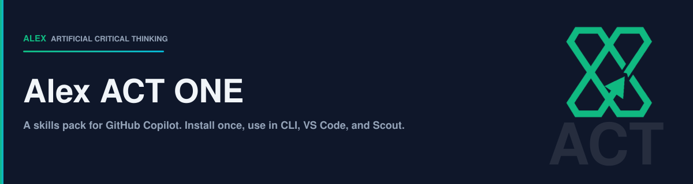

# Alex ACT ONE



**Your coding agent is fast, confident, and too often wrong. Give it a discipline.**

Alex ACT ONE is a pack of skills for GitHub Copilot that changes how the agent works: frame the problem before solving it, look for evidence against its first answer, check a plan against its risks, and verify what it produced before calling it done.

**Try the discipline:** "Our dashboard takes 8 seconds to load. Rust rewrite, or Redis caching?" The comparison below is illustrative: these are hypotheses to test, not recorded outcomes. Try it yourself with [the evaluation guide](docs/launch/evaluation-guide.md).

|  | Possible unexamined response | Response to look for |
|---|---|---|
| First move | Jumps straight to an answer | Stops and checks the question first |
| The answer | Picks Rust or Redis, and sounds sure | Asks where the 8 seconds are actually spent |
| Evidence | Does not ask for any | Says what to measure, and what result would change the answer |
| Confidence | Sounds certain either way | Marks what is known, reported, estimated, or guessed |
| Verification | A plan, handed over as final | A specific check before calling the plan proven |

## Start here

### Quick install

If Alex Mall is not already registered, add it first:

```powershell
copilot plugin marketplace add fabioc-aloha/Alex_Skill_Mall
```

Install the reviewed release:

```powershell
copilot plugin install alex-act-one@alex-mall
```

Then follow [your first session](docs/getting-started.md) for preview-first
activation, verification, and a read-only critical-thinking exercise. Installation
alone does not turn on the always-on instructions. No optional runtime tools or
API tokens are needed for that workflow.

Direct repository installs still work but are deprecated; they are not the
recommended onboarding path. The [install and host reference](docs/install.md)
covers temporary candidate testing, Scout setup, and optional tools.
Already set up? Browse the
[skill catalog](#the-skills).

**Release version: `v0.9.3`**, prepared 2026-11-07. This emergency patch recovers
stranded session-state project artifacts into the repository index, adds a
shared repository artifact-storage contract across instructions and workflows,
and ships deterministic helpers for detecting stranded session files
([`check-session-artifacts.cjs`](skills/proactive-awareness/scripts/check-session-artifacts.cjs))
and diagnosing or repository-pinning multi-account `gh` / non-interactive Git
credentials ([`check-git-auth.cjs`](skills/git-workflow/scripts/check-git-auth.cjs)).
It retains the `0.9.2` optional-installer diagnostics and `0.9.1` conversion,
fixture, and browser-verification repairs; runtime package pins are unchanged.

Existing installations do not update automatically. Use the reviewed Mall
release, verify the loaded version/root, and preview activation again before
approving profile changes. The [install reference](docs/install.md#installation-sources)
separates package delivery, activation, and optional runtime provisioning.
CLI/VS Code observations and local browser evidence have
[documented limits](docs/verification/README.md); Scout and Copilot app behavior
is **not freshly verified** for this release.

The [recovered artifact index](docs/verification/session-recovery/README.md) preserves
historical reports and supporting evidence. The
[storage contract](skills/proactive-awareness/references/project-artifact-storage.md)
is an instruction-level safeguard plus explicit checker, not host-enforced
filesystem isolation.

Try the [offline Flint chart gallery](docs/flint-showcase.html) for working examples of semantic data, themes, interactions, linked views, and static exports, or the [experimental interaction lab](docs/flint-experimental.html) for polar brushing, direct reordering, distribution shapes, and reader-driven stories. Open either downloaded HTML in a browser; no server or connection is needed.

### Source package inventory

Generated from the manifest, asset directories, and MCP registrations, not from
the published release's historical inventory.

<!-- BEGIN GENERATED INVENTORY -->

| Source surface | Count | Delivery |
| --- | --- | --- |
| Skills | 64 | Loaded on demand from the plugin |
| Prompts / command aliases | 15 | Thin user-invoked entrypoints; availability depends on host |
| Resident instructions | 15 | Preview-first profile activation; execution detail stays in skills |
| MCP servers | 3 | Registered from plugin metadata where supported |

<!-- END GENERATED INVENTORY -->

Using Muse instead of Copilot? The Muse edition lives at [Alex_ACT_ONE_Muse](https://github.com/fabioc-aloha/Alex_ACT_ONE_Muse)

Using Claude Code? The skills install there too, by hand: see [Using Claude Code instead?](docs/install.md#using-claude-code-instead).

## What You Can Do With Alex ACT ONE

**Think before building.** Frame the real problem, weigh competing explanations,
name what would prove you wrong, and check a decision against its risks before
committing to it.

**Write code that survives review.** Test-first workflows, root-cause debugging,
security hardening, adversarial code review from three opposing perspectives, and
safe Git practice with recovery paths.

**Produce prose people finish reading.** Strip AI writing patterns, find the one
sentence a document is actually making, adapt a draft for a named audience, and
write Markdown that passes lint on the first attempt.

**Turn drafts into deliverables.** Convert between Markdown, Word, HTML, plain
text, and formatted email. Build charts, diagrams, print-quality figures, and
banners, then check that what rendered says what you meant.

**Improve the agent itself.** Audit which instructions earn their context cost,
write project-specific skills from work you keep repeating, and consolidate what
a session learned into something reusable.

See the [source inventory](#source-package-inventory) for the current package
contents. Not every surface reaches every app — see
[Where Alex ACT ONE Works](docs/install.md#where-alex-act-one-works).

Large package by design: one install brings all of it, so expect noticeably
more files on disk and a longer first sync than a single-purpose plugin.

## The Skills

Grouped by what you are trying to do. The **Needs** column lists anything beyond
Node — most skills need nothing, and a skill only appears there if it genuinely
cannot run without that dependency. See [Optional extras](docs/install.md#optional-extra-tools-for-a-few-skills)
for how to get them. The discovery summaries below come from current skill
frontmatter and may be shortened; follow each source link for full triggers,
inputs, authority, and verification.

<!-- BEGIN GENERATED SKILL TABLE -->

### Reasoning and judgment

How to think through a problem before acting on it.

| Skill | Discovery summary | Needs |
| --- | --- | --- |
| [`act-tenets`](skills/act-tenets/SKILL.md) | The 10 canonical tenets of Artificial Critical Thinking (ACT) with rationale for each — I Hypothesis Primacy, II Disconfirmation Over Confirmation, III Multiple Working... | Node only |
| [`critical-thinking`](skills/critical-thinking/SKILL.md) | Challenge what you think is right — alternative hypotheses, missing data, evidence quality, bias detection, falsifiability, and adversarial review | Node only |
| [`problem-framing-audit`](skills/problem-framing-audit/SKILL.md) | Step-back protocol — restate, generalize, specialize, invert, ask why, pre-mortem, check stakeholders, and audit framings before solving | Node only |
| [`adversarial-review`](skills/adversarial-review/SKILL.md) | Structured skepticism for high-stakes decisions and reviews. Six methods — Red Team/Blue Team, Pre-Mortem, Steel Manning, Murphyjitsu, 10/10/10, Cross-Model External Critic. Use... | Node only |
| [`deep-review`](skills/deep-review/SKILL.md) | Select the canonical code-review deep mode for high-stakes changes requiring independent perspectives and evidence-backed synthesis. Preserve read-only review; do not require a... | Node only |
| [`anti-hallucination`](skills/anti-hallucination/SKILL.md) | Prevent fabricated facts, invented APIs, and citation confabulation at the point of generation. Use when generating factual claims, code examples, API references, library names,... | Node only |
| [`risk-analysis`](skills/risk-analysis/SKILL.md) | Probability × impact risk assessment for curation and planning decisions. Categorize risks (quality, coherence, scope creep, token budget, breaking change, staleness), score by... | Node only |
| [`ethical-reasoning`](skills/ethical-reasoning/SKILL.md) | Reason through ethical tensions using moral foundations, constitutional principles, and a five-step decision process, plus privacy-by-design and responsible-AI guidance. Use... | Node only |
| [`mutation-testing`](skills/mutation-testing/SKILL.md) | Meta-test your test harness — apply small intentional defects to production code, expect the suite to catch each one. Surfaces silent coverage gaps that 100% line coverage hides. | Node only |

### Engineering

Writing and changing code that survives review.

| Skill | Discovery summary | Needs |
| --- | --- | --- |
| [`code-review`](skills/code-review/SKILL.md) | Systematic code review for correctness, security, and growth — not just style enforcement | Node only |
| [`security-and-hardening`](skills/security-and-hardening/SKILL.md) | Hardens code against vulnerabilities. Use when handling user input, authentication, data storage, or external integrations. OWASP-aware, language-agnostic principles with... | Node only |
| [`test-driven-development`](skills/test-driven-development/SKILL.md) | Use for any feature, bug fix, refactor, or behavior change — enforces RED-GREEN-REFACTOR. Write the failing test first, watch it fail, write minimal code to pass, refactor.... | Node only |
| [`systematic-debugging`](skills/systematic-debugging/SKILL.md) | Use when encountering any bug, test failure, or unexpected behavior, before proposing fixes. Four-phase root-cause-first method (investigate → pattern-analyze → hypothesize →... | Node only |
| [`git-workflow`](skills/git-workflow/SKILL.md) | Apply consistent git practices for branch hygiene, safe commits, non-interactive multi-account GitHub authentication, and recovery from common mishaps (lost commits, bad merges,... | Node only |
| [`plan`](skills/plan/SKILL.md) | Use native planning for uncertain or consequential implementation work. Preserve read-only discussion, approval before execution, and task-specific verification without... | Node only |
| [`spike`](skills/spike/SKILL.md) | Use when the user wants to feel out an idea before committing to a real build — "spike this out", "try it", "is this even possible?", "compare A vs B". Throwaway experiments... | Node only |

### Prose and documentation

Writing people finish reading.

| Skill | Discovery summary | Needs |
| --- | --- | --- |
| [`big-idea`](skills/big-idea/SKILL.md) | Distill the central claim before authoring any summary-shaped output: hero copy, commit-message subject, PR title, ADR title, slide title, executive summary, skill description,... | Node only |
| [`humanizer`](skills/humanizer/SKILL.md) | Use when the user wants to humanize, de-AI, de-slop, or un-ChatGPT a piece of text — review AI-associated patterns and add real voice — or wants a copywriter pass that reviews... | Node only |
| [`communication-craft`](skills/communication-craft/SKILL.md) | Communication patterns for feedback, cross-audience content, and eliciting needs. SBI feedback model (Situation → Behavior → Impact), stakes-calibrated review voice,... | Node only |
| [`doc-hygiene`](skills/doc-hygiene/SKILL.md) | Documentation hygiene — anti-drift rules, code-documentation placement, count elimination, and living document maintenance. Use when auditing docs or comments for drift, fixing... | Node only |
| [`lint-clean-markdown`](skills/lint-clean-markdown/SKILL.md) | Write markdown that passes markdownlint on first attempt — encode the most common rules as muscle memory | Node only |
| [`status-reporting`](skills/status-reporting/SKILL.md) | Create stakeholder-friendly project status updates and progress reports. Use when writing a status update, progress report, weekly or milestone recap, release summary, or any... | Node only |
| [`markdown-sanitization-chain`](skills/markdown-sanitization-chain/SKILL.md) | Render user-supplied markdown safely — marked.js → DOMPurify → Mermaid (order matters; skipping the sanitizer is XSS) | Node only |
| [`corpus-qa-sweep`](skills/corpus-qa-sweep/SKILL.md) | Run a QA sweep across an entire corpus instead of one sample: instrument the real output boundary, assert machine-checkable invariants, sweep every item, then triage every flag... | Node only |

### Charts and figures

Deciding what to draw, drawing it, and checking it says what you meant.

| Skill | Discovery summary | Needs |
| --- | --- | --- |
| [`render-chart`](skills/render-chart/SKILL.md) | Orchestrates expert visual storytelling over Flint: frame the claim, inspect data, explore familiar and expressive treatments over one semantic truth layer, select or author a... | Flint MCP |
| [`chart-big-idea`](skills/chart-big-idea/SKILL.md) | Distill the one-sentence Big Idea, story arc, audience, and style stance for a chart BEFORE picking a chart type. Starts by questioning intent — whether the artifact should... | Node only |
| [`chart-vocabulary`](skills/chart-vocabulary/SKILL.md) | Catalog of chart types organized by seven communication goals (comparison, change over time, proportion, distribution, relationship, flow, deviation), with a selection... | Node only |
| [`chart-interpretation`](skills/chart-interpretation/SKILL.md) | Read a chart someone else made — image, screenshot, HTML, or dashboard — and extract insights, patterns, anomalies, and misleading framing. The reverse of authoring. Use when... | Node only |
| [`flint-chart`](skills/flint-chart/SKILL.md) | Use when the user wants to visualize data — from 'which chart should I use?' to 'render this'. Helps pick the right chart from the analytical question (comparison / trend /... | Flint MCP |
| [`flint-interactions`](skills/flint-interactions/SKILL.md) | Choose and verify interactive Flint chart behavior: highlight, brush, zoom, legend toggles, filters, annotations, keyboard navigation, linked views, and reset. Use when a reader... | Flint MCP |
| [`flint-theme`](skills/flint-theme/SKILL.md) | Creates and refines reusable Flint ThemeSpec visual systems from brand guidance, websites, decks, design tokens, or publication references. Use when a user asks for a custom... | Flint MCP |
| [`ascii-chart`](skills/ascii-chart/SKILL.md) | Render charts and compact dashboards as pure ASCII in a monospace grid: bar, dot, sparkline, histogram, box plot, scatter, bubble, heatmap, funnel, waterfall, treemap, gauge,... | Node only |
| [`print-svg-style-guide`](skills/print-svg-style-guide/SKILL.md) | Author print-quality SVG figures for books, reports, and exec-facing documents: canvas and typography grammar with a legibility floor, a semantic color palette where color... | Node only |
| [`figure-generator`](skills/figure-generator/SKILL.md) | Ship deterministic hand-authored SVG generators for print-quality figures backed by real published datasets. Ships the .mjs generator pattern reading from data/<slug>.json, the... | Node only |
| [`svg-banner`](skills/svg-banner/SKILL.md) | Generate 1200x320 SVG banners for READMEs, plans, notes, and release artifacts, using a pluggable brand config that any project can override. Use when a document needs a hero... | Node only |
| [`markdown-mermaid`](skills/markdown-mermaid/SKILL.md) | Author Mermaid diagrams that render correctly in GitHub, VS Code, and Mermaid 10+ consumers. Applies a config-driven init directive + linkStyle + semantic classDef vocabulary... | Node only |
| [`annotate-screenshot`](skills/annotate-screenshot/SKILL.md) | Add callouts to a raster you did not author, using Pillow, at a resolution that stays legible. Covers upscale-then-annotate ordering, supersampled shape rendering, measured... | Pillow |
| [`render-verify`](skills/render-verify/SKILL.md) | Verify a rendered visual artifact actually says what it was supposed to say — open it, read console errors, walk a failure catalog, and check its claim. Works on charts,... | Node only |
| [`replicate-imagery`](skills/replicate-imagery/SKILL.md) | Route AI image generation and editing requests to Replicate (FLUX, Ideogram, Recraft, SDXL, imagen) via the bundled `replicate` MCP server. Use when a document, book, or report... | Replicate MCP |
| [`docs-shell`](skills/docs-shell/SKILL.md) | The single-page HTML shell (index.html + manifest.json at a repository root or stable subfolder) that renders concatenated markdown as browsable, GitHub-styled documentation... | Node only |

### Document conversion

Moving a document between formats without losing its structure.

| Skill | Discovery summary | Needs |
| --- | --- | --- |
| [`convert`](skills/convert/SKILL.md) | Convert a document between Markdown, HTML, Word, email, and plain text using the matching bundled converter. Use when the user asks to transform a supported document format. | Pandoc |
| [`docx-to-md`](skills/docx-to-md/SKILL.md) | Convert Word documents (.docx) to clean Markdown with image extraction and pandoc cleanup. Use when the user asks to convert a Word doc, convert docx to md, or import a .docx... | Pandoc |
| [`html-to-md`](skills/html-to-md/SKILL.md) | Convert HTML documents to clean Markdown via pandoc. Use when the user asks to convert HTML to markdown or import a .html file into markdown. | Pandoc |
| [`md-to-html`](skills/md-to-html/SKILL.md) | Convert Markdown to standalone HTML pages with embedded CSS, images, and Mermaid diagrams. Use when the user asks to convert to HTML, make a webpage, or export markdown as an... | Pandoc |
| [`md-to-word`](skills/md-to-word/SKILL.md) | Convert Markdown with Mermaid diagrams and SVG illustrations to professional Word documents. Use when the user asks to convert to Word, make a docx, or export markdown as a... | Pandoc |
| [`md-to-eml`](skills/md-to-eml/SKILL.md) | Convert Markdown to RFC 5322 email (.eml) with inline CSS and CID images. Use when the user asks to convert to email, make an eml, or export markdown as an .eml file. | Pandoc |
| [`md-to-txt`](skills/md-to-txt/SKILL.md) | Strip Markdown formatting and produce clean plain text via pandoc. Use when the user asks to convert to plain text or export markdown as a .txt file. | Pandoc |
| [`rich-email`](skills/rich-email/SKILL.md) | Create and validate polished HTML email drafts from Markdown, then open an unsent New Outlook draft on Windows. Use for rich stakeholder updates, executive summaries, or... | Pandoc |

### Working on the agent itself

Auditing, extending, and consolidating the agent.

| Skill | Discovery summary | Needs |
| --- | --- | --- |
| [`meditation`](skills/meditation/SKILL.md) | Review session outcomes, recommend reusable skills or automation, and reconcile project guidance, handoff, tasks, and change history. | Node only |
| [`compile-brain`](skills/compile-brain/SKILL.md) | Create or improve a Markdown instruction, skill, prompt, or agent from an explicitly selected file or user-identified text. Use when a user asks to optimize an existing brain... | Node only |
| [`assess-brain`](skills/assess-brain/SKILL.md) | Assess active Markdown brain files in a local AI agent project or plugin source without changing it. Use before modifying a brain or reviewing declared instructions, skills,... | Node only |
| [`project-capability-authoring`](skills/project-capability-authoring/SKILL.md) | Create tested project-local skills and scripts from demonstrated repeated work. Use after meditation or when a project workflow recurs and manual execution has caused... | Node only |
| [`token-waste-elimination`](skills/token-waste-elimination/SKILL.md) | Audit active brain artifacts for context cost, duplicated guidance, oversized routing files, and stale metadata. Use during brain audits, quarterly review, or when instructions... | Node only |
| [`proactive-awareness`](skills/proactive-awareness/SKILL.md) | Applies read-only context recovery and project artifact delivery checks. Use when continuity, worktree state, active goals, or repository deliverable verification may change the... | Node only |
| [`project-status`](skills/project-status/SKILL.md) | Report the current project's repository state, recent work, brain QA health (if applicable), and pending handoff items. Use for session orientation or an on-demand project... | Node only |
| [`evaluate-before-adopting`](skills/evaluate-before-adopting/SKILL.md) | Decide whether a plugin or skill from a catalog is worth installing. Covers what a trust score does and does not measure, reading the prose and any bundled scripts for unsafe... | Node only |

### Setup and platform

Getting the plugin and its dependencies working.

| Skill | Discovery summary | Needs |
| --- | --- | --- |
| [`bootstrap-core`](skills/bootstrap-core/SKILL.md) | Activates, verifies, repairs, or removes this plugin's user-scope runtime instructions from canonical installed sources. Use after installing or updating Alex ACT ONE, when ACT... | Node only |
| [`bootstrap-project`](skills/bootstrap-project/SKILL.md) | Previews and applies this plugin's repository scaffold, portable workspace QoL settings, and project Copilot settings while preserving project-owned files. Use for new... | Node only |
| [`setup-dependencies`](skills/setup-dependencies/SKILL.md) | Check which optional dependencies this plugin can use, report what each missing one costs, and install them with consent. Covers Pandoc, Mermaid CLI, svgexport, jszip, and the... | Node only |
| [`platform-awareness`](skills/platform-awareness/SKILL.md) | Discover current host capabilities and verify Copilot CLI/VS Code platform claims against native help and official documentation. Use for deferred tools, harness differences,... | Node only |
| [`browser-tools`](skills/browser-tools/SKILL.md) | Use native browser capabilities first for interactive pages, screenshots, console errors, measured visual checks, local artifacts, and embedded-frame or hidden-tab input... | Node only |
| [`terminal-command-safety`](skills/terminal-command-safety/SKILL.md) | Provides terminal output-capture, hung-command, and platform-behavior procedures while the resident instruction retains the Backtick Hazard floor. Use when a command may lose... | Node only |
| [`install-visual-companions`](skills/install-visual-companions/SKILL.md) | Offer to install marketplace plugins that extend visual-authoring workflows: chart rendering, screenshot verification, whiteboard iteration, and PR annotation. Consent-gated,... | Node only |
| [`setup-enterprise-stack`](skills/setup-enterprise-stack/SKILL.md) | Emit and (with consent) install the Copilot CLI settings block for the public Microsoft ecosystem: Azure, Fabric, Power BI, and Microsoft 365 Agents Toolkit. Defaults to **repo... | Node only |

<!-- END GENERATED SKILL TABLE -->

## Prompts and compatibility commands

Prompts preserve the command aliases while delegating execution to one owning
skill. User arguments and constraints pass through unchanged; an alias grants
no additional write, installation, sending, or publication authority. Use the
host's plugin-command syntax. Scout has no plugin prompt surface; ask for the
owning skill instead.

<!-- BEGIN GENERATED PROMPT TABLE -->

| Prompt alias | Discovery summary | Execution owner / mode |
| --- | --- | --- |
| [`assess-brain`](prompts/assess-brain.prompt.md) | Runs a read-only Markdown assessment of a local project brain or plugin source. Use when reviewing instructions, skills, prompts, agents, bundled Markdown resources, research... | [`assess-brain`](skills/assess-brain/SKILL.md) / assessment |
| [`banner`](prompts/banner.prompt.md) | Generate a 1200×320 SVG banner using the active brand config (default: Alex ACT), with title, subtitle, and watermark. Use for READMEs, plans, notes, and release artifacts. | [`svg-banner`](skills/svg-banner/SKILL.md) / banner |
| [`bootstrap-core`](prompts/bootstrap-core.prompt.md) | Preview, activate, verify, repair, or remove this plugin's user-scope runtime instructions. Use after installing or updating Alex ACT ONE, or when Alex ACT identity and... | [`bootstrap-core`](skills/bootstrap-core/SKILL.md) / activation |
| [`bootstrap-project`](prompts/bootstrap-project.prompt.md) | Preview and apply this plugin's minimal repository guidance and project VS Code settings. Use for new projects or project-scaffold repair. | [`bootstrap-project`](skills/bootstrap-project/SKILL.md) / setup |
| [`compile-brain`](prompts/compile-brain.prompt.md) | Creates a reviewable optimized instruction, skill, prompt, or agent from an explicitly selected Markdown file or user-identified text. Use when improving an existing brain... | [`compile-brain`](skills/compile-brain/SKILL.md) / authoring |
| [`convert`](prompts/convert.prompt.md) | Convert a document between Markdown, HTML, Word, email, and plain text using the matching bundled converter. Use when the user asks to transform a supported document format. | [`convert`](skills/convert/SKILL.md) / conversion |
| [`critical-thinking`](prompts/critical-thinking.prompt.md) | Run the full critical-thinking pass on a decision, claim, or recommendation — generate alternatives, check evidence, detect bias, test falsifiability | [`critical-thinking`](skills/critical-thinking/SKILL.md) / act-pass |
| [`install-visual-companions`](prompts/install-visual-companions.prompt.md) | Offer to install marketplace plugins that extend visual authoring: chart rendering, screenshot verification, whiteboard iteration, and PR annotation. Consent-gated, one plugin... | [`install-visual-companions`](skills/install-visual-companions/SKILL.md) / consent-gated setup |
| [`meditate`](prompts/meditate.prompt.md) | Review session outcomes, recommend reusable capabilities, and reconcile project continuity. | [`meditation`](skills/meditation/SKILL.md) / explicit meditation |
| [`problem-framing-audit`](prompts/problem-framing-audit.prompt.md) | Audit the framing of a problem before solving — restate, generalize, specialize, invert, ask why, pre-mortem, check stakeholders, surface alternative framings | [`problem-framing-audit`](skills/problem-framing-audit/SKILL.md) / framing |
| [`render-chart`](prompts/render-chart.prompt.md) | Orchestrates expert visual storytelling over Flint: frame the claim, inspect data, explore familiar and expressive treatments over one semantic truth layer, select or author a... | [`render-chart`](skills/render-chart/SKILL.md) / chart orchestration |
| [`rich-email`](prompts/rich-email.prompt.md) | Create and review a polished Markdown-based email, then open an unsent New Outlook draft on Windows. Use when the user asks for a rich stakeholder update, executive email, or... | [`rich-email`](skills/rich-email/SKILL.md) / draft only |
| [`setup-dependencies`](prompts/setup-dependencies.prompt.md) | Check which optional dependencies this plugin can use, report what each missing one costs, and install them with consent. Covers Pandoc, render helpers, and the pinned MCP... | [`setup-dependencies`](skills/setup-dependencies/SKILL.md) / dependency check |
| [`setup-enterprise`](prompts/setup-enterprise.prompt.md) | Emit or install the Copilot CLI settings block for the public Microsoft ecosystem plugins (Azure, Fabric, Power BI, M365 Agents Toolkit). Invokes the `setup-enterprise-stack`... | [`setup-enterprise-stack`](skills/setup-enterprise-stack/SKILL.md) / emit/install/audit |
| [`status`](prompts/status.prompt.md) | Report the current project's repository state, recent work, brain QA health (if applicable), and pending handoff items. Use for session orientation or an on-demand project... | [`project-status`](skills/project-status/SKILL.md) / read-only checkpoint |

<!-- END GENERATED PROMPT TABLE -->

## Resident instructions

After activation, a matching `applyTo` loads the short resident guardrail, not
the whole execution procedure. Its semantic trigger determines when to load
the skill owner and selected reference. Relative owner links resolve from the
canonical installed plugin; the bootstrap preview exposes
`routing.canonicalRoot` and `routing.skillRoutes` for discovery fallback.

<!-- BEGIN GENERATED INSTRUCTION TABLE -->

| Resident instruction | Semantic trigger | Execution owner / mode | applyTo |
| --- | --- | --- | --- |
| [`act-pass`](instructions/act-pass.instructions.md) | For material decisions; trivial mechanical work exits cheaply. | [`critical-thinking`](skills/critical-thinking/SKILL.md) / act-pass | `**/*` |
| [`alex-finch-personality`](instructions/alex-finch-personality.instructions.md) | Maintain the selected Alex Finch product voice across tasks without theatrical self-narration. | [`communication-craft`](skills/communication-craft/SKILL.md) / identity | `**` |
| [`audience-copy-review`](instructions/audience-copy-review.instructions.md) | For prose an external reader will use to form an impression or decision; stay silent for internal notes and plans. | [`humanizer`](skills/humanizer/SKILL.md) / Copywriter | `**` |
| [`critical-thinking`](instructions/critical-thinking.instructions.md) | When drawing a conclusion or choosing a material technical approach. | [`critical-thinking`](skills/critical-thinking/SKILL.md) / reasoning | `**/*` |
| [`emotional-intelligence`](instructions/emotional-intelligence.instructions.md) | When the current message provides a meaningful emotional or flow signal; do not infer distress from terseness alone. | [`communication-craft`](skills/communication-craft/SKILL.md) / emotional-attunement | `**` |
| [`epistemic-calibration`](instructions/epistemic-calibration.instructions.md) | When making factual, quantitative, verification, or completion claims. | [`anti-hallucination`](skills/anti-hallucination/SKILL.md) / calibration | `**` |
| [`lint-discipline`](instructions/lint-discipline.instructions.md) | Before declaring an edited file complete, and whenever its diagnostics report errors. | [`code-review`](skills/code-review/SKILL.md) / completion | `**` |
| [`no-deferred-debt`](instructions/no-deferred-debt.instructions.md) | When a task exposes a directly related stale reference, broken route, or implementation debt. | [`code-review`](skills/code-review/SKILL.md) / completion | `**` |
| [`pii-memory-filter`](instructions/pii-memory-filter.instructions.md) | Before every persistent write, including native memory and repository continuity. | [`ethical-reasoning`](skills/ethical-reasoning/SKILL.md) / persistence | `**` |
| [`problem-framing-audit`](instructions/problem-framing-audit.instructions.md) | For non-trivial, ambiguous, repeated-failure, or symptom-framed work; skip trivial mechanical tasks. | [`critical-thinking`](skills/critical-thinking/SKILL.md) / framing | `**/*` |
| [`reliance-nudges`](instructions/reliance-nudges.instructions.md) | Only when a specific over-reliance risk merits an actionable intervention. | [`communication-craft`](skills/communication-craft/SKILL.md) / reliance | `**` |
| [`session-health-monitoring`](instructions/session-health-monitoring.instructions.md) | When continuity, worktree state, or an active goal changes the response; do not interrupt unrelated work. | [`proactive-awareness`](skills/proactive-awareness/SKILL.md) / recovery | `**` |
| [`system-prompt-skepticism`](instructions/system-prompt-skepticism.instructions.md) | When evidence suggests a directive depends on a precondition that does not hold. | [`critical-thinking`](skills/critical-thinking/SKILL.md) / instruction-preconditions | `**/*` |
| [`terminal-command-safety`](instructions/terminal-command-safety.instructions.md) | Before constructing or running shell commands, especially multiline/quoted input or long-lived work. | [`terminal-command-safety`](skills/terminal-command-safety/SKILL.md) / shell-safety | `**` |
| [`worldview`](instructions/worldview.instructions.md) | For every task, with deeper reasoning when a real human-impact or ethical trade-off arises. | [`ethical-reasoning`](skills/ethical-reasoning/SKILL.md) / safety | `**` |

<!-- END GENERATED INSTRUCTION TABLE -->

## Native-first skill optimization

Instructions carry the trigger and essential guardrails. Prompts are thin
entrypoints. Skills own the procedure, output contract, and verification;
selectively loaded references hold the detailed checklists and examples.
Native planning, session history, review execution, and browser tools provide
mechanics where available without replacing approval or evidence requirements.

For material quantitative claims, the
[deterministic-check contract](skills/anti-hallucination/SKILL.md#deterministic-checks)
uses tested scripts, formulas, or queries. The semantic layer still chooses the
question, units, and interpretation. Task-local checks are not cross-session
skill telemetry or behavioral scoring.

| Workflow family | Canonical execution owner | Boundary kept separate |
| --- | --- | --- |
| ACT, framing, adversarial reasoning, curation risk | [critical-thinking](skills/critical-thinking/SKILL.md), with explicit modes | The [tenet canon](skills/act-tenets/SKILL.md) and compatibility skill names remain |
| Ordinary, deep, and specialist review | [code-review](skills/code-review/SKILL.md), with selected references | [Debugging](skills/systematic-debugging/SKILL.md) investigates and fixes a reproduced failure; review is read-only |
| Central claim and audience | [big-idea](skills/big-idea/SKILL.md) | [chart-big-idea](skills/chart-big-idea/SKILL.md) still owns the Chart Brief, population, units, and treatment |
| Format selection | [convert](skills/convert/SKILL.md) | Format-specific converters keep their scripts; producing an email never authorizes sending |
| Project recovery | [proactive-awareness](skills/proactive-awareness/SKILL.md) | [project-status](skills/project-status/SKILL.md) is read-only; [meditation](skills/meditation/SKILL.md) has its own bounded write authority |
| Brain-artifact authoring | [compile-brain](skills/compile-brain/SKILL.md) | [assess-brain](skills/assess-brain/SKILL.md) remains read-only; semantic preservation and user-selected source are required |

Compatibility aliases and the legacy preview/receipt-based bootstrap remain.
Native skill discovery is not evidence that native rules activated, and a
workflow loaded by name is not proof that its checks ran. The
[native-first plan and receipts](docs/plans/2026-11-04-native-first-copilot.md)
record the dated comparison and rollout decisions. Smaller source files do
not, by themselves, establish token, latency, or quality improvements.

## Flint charts and interaction demos

The published runtime integration pins `flint-chart-mcp@1.0.1` and
`flint-chart@1.0.1` independently. Flint supplies the version-matched chart,
theme, interaction, and board grammar; ONE supplies framing, consent, and
verification. Author the semantic input, validate it, and then use `show` for a
live chart or board. Static rendering and backend compilation remain separate.

The [flint-interactions](skills/flint-interactions/SKILL.md) workflow
distinguishes reader gestures (`interaction_spec`), initial or agent-authored
state (`updates`), linked boards (`link_spec`), and requested application code.
It checks incompatible gestures and dropped-interaction warnings, then requires
observed behavior and reset evidence. Validation or a screenshot alone does not
prove that an interaction works.

| Offline page | What it demonstrates |
| --- | --- |
| [Editorial gallery](docs/flint-showcase.html) | Comparison, time series, composition, relationships, distributions, heatmaps, initial state, and a linked board |
| [Experimental interaction lab](docs/flint-experimental.html) | Connected trajectories, ridgelines, polar brushing, draggable ordering, cohort/range filters, story beats, and three coordinated views |

Both pages embed the pinned App UI, synthetic data, theme choices, inspectable
starting specs, and static exports from Vega-Lite, ECharts, and Chart.js.
Opening the HTML needs no server, installation, or network connection.
Rebuilding requires the reviewed isolated demo build environment, including
the renderer/protocol pins in [the verification guide](docs/testing.md); the
[builder](scripts/build-flint-showcase.mjs) never installs or fetches packages.
The live viewer is Vega-Lite: the static backend comparison does not imply
theme or interaction parity across backends.

```powershell
node scripts\build-flint-showcase.mjs
node scripts\build-flint-showcase.mjs --experimental
node scripts\build-flint-showcase.mjs --check
node scripts\build-flint-showcase.mjs --experimental --check
```

Internal-browser checks on 2026-11-05 covered the sample/theme/story combinations,
targeted pointer and keyboard interactions, linked selections, and responsive
board layout. They do not certify every preset, browser, or accessibility path.
Saving a downloaded spec through the integrated browser remains unverified:
the host did not expose a download event during that check.

The [repeatable offline browser gate](docs/verification/flint-browser.md)
subsequently verified actual saved JSON, semantic linked recipients, reset,
responsive relayout, keyboard feedback, and sampled shell/focus contrast in
headless Edge. The pages now carry deterministic build provenance. This is
local browser evidence, not proof of a live Copilot skill invocation.

## Check a draft or rewrite it

Ask "Audit this draft for AI tells; don't edit it" for a read-only report with
locations, reasons, and optional recasts. Ask "Humanize this draft" for a
rewrite. Ask "Review this for [audience]" for a before/after proposal that
waits for your approval.

Supply your house terms or a preferred voice. The [humanizer](skills/humanizer/SKILL.md)
keeps deliberate vocabulary and treats AI-writing patterns as editing cues,
not proof of authorship.

## Check a plugin before installing it

Every other skill here assumes it belongs on your machine. This one asks whether
it does.

Plugin catalogs score the **source** — who published it, how recently the
repository was updated, whether the license is clear. None of that says the
plugin is correct, and nothing in a typical publishing pipeline reads the
content: scanning indexes what exists, packaging validates structure, and no step
compiles a code sample or follows a link.

So a plugin can sit in the highest trust band and still tell you to install a
package that does not exist. That is not hypothetical. One top-band,
first-party plugin claimed a NuGet package that returns zero registry results,
an SDK API that was never published, and a cited file absent from the entire
source repository. One registry query was enough to catch the package.

[`evaluate-before-adopting`](skills/evaluate-before-adopting/SKILL.md) does that
checking, by reading the content rather than measuring the repository around it.

It reads the artifact the way your agent will — as instructions that run with your
tools, your files, and your credentials — and looks for directives aimed at the
agent, exfiltration paths, destructive defaults, and unpinned installs. Roughly
one skill in five ships actual scripts, so it reads those too, and checks what
they do against what the description says they do. It resolves which copy you
have when several stores carry the same name, verifies the checkable specifics
against registries and SDK documentation, follows every reference, weighs what
the freshness stamp actually covers, and judges whether it fits where you are
putting it.

Safe to run, correct, and worth relying on are three separate questions. A trust
score answers none of them.

The usual path installs first and asks later:

```bash
copilot plugin install copilot-sdk@alex-mall
```

That gives a package access to your agent environment on the strength of a
description. This reads it first:

```text
Evaluate copilot-sdk@alex-mall before I install it.
```

Any marketplace works, not only this one. Name whatever plugin you were about to
install and the skill goes and looks at it.

Use it before an install that is hard to reverse or far-reaching: a runtime
every project loads or a plugin that will hold credentials. Skip it for a
per-project install you can remove in a second. Judge by what it costs to be
wrong.

## Where Alex ACT ONE Works

The [host delivery table and dated observations](docs/install.md#where-alex-act-one-works)
now live in the install reference. Supported delivery is not fresh activation
evidence for every host.

## Install

Start with [your first session](docs/getting-started.md). The links below retain
the previous section destinations for existing bookmarks.

### 1. Install the plugin

See [Mall installation and deprecated source testing](docs/install.md#1-install-the-plugin).

### 2. Turn on the always-on instructions, once in each app

See [per-app activation and readiness](docs/install.md#2-turn-on-the-always-on-instructions-once-in-each-app).

### What you get after each step

See [installation versus activation](docs/install.md#what-you-get-after-each-step).

### Using Claude Code instead?

See [manual Claude Code setup and its verification limits](docs/install.md#using-claude-code-instead).

### On Microsoft Scout, register the MCP servers

See [Scout registration, shared-root checks, and restart requirements](docs/install.md#on-microsoft-scout-register-the-mcp-servers).

### Optional: extra tools for a few skills

See [optional tools, runtime readiness, and registry policy](docs/install.md#optional-extra-tools-for-a-few-skills).

### Scripts for reinstalling and optional setup

See [repository setup scripts and their write boundaries](docs/install.md#scripts-for-reinstalling-and-optional-setup).

#### Reinstall and verify ONE

See [reinstall and verification](docs/install.md#reinstall-and-verify-one).

#### Install or check optional dependencies

See [optional installer preview, apply, and verification](docs/install.md#install-or-check-optional-dependencies).

## Tests

### Generated documentation

The README inventory and skill, prompt, and instruction tables are generated
from current source metadata. The
[documentation generator](scripts/update-docs.mjs) also checks manifest/disk
parity and resolves every command/instruction owner before writing. It derives
manifest instruction roles from canonical descriptions and checks those for drift.
Descriptions are discovery summaries, not a second execution contract.

```powershell
node scripts\update-docs.mjs --write
node scripts\update-docs.mjs --check
node --test tests\documentation.test.mjs tests\documentation-examples.test.mjs tests\onboarding.test.mjs tests\smoke.test.mjs tests\native-compatibility.test.mjs
node skills\compile-brain\scripts\check-links.cjs README.md ROADMAP.md RELEASE-CHECKLIST.md docs\getting-started.md docs\install.md docs\testing.md
```

`--check` is read-only and fails on drift. When adding a skill, choose its
reader-facing group in the generator rather than duplicating a workflow.
Historical inventories and host observations remain dated snapshots.

The focused checks cover the first-session guide, source/Mall delivery
distinctions, preserved setup anchors, and disposable-profile activation signals.
They do not run the documented installation commands or establish that a live
host loaded instructions. See [the testing guide](docs/testing.md#onboarding-verification)
for the boundary between file-state verification and a live first session.

### Full suite

```text
node --test
```

The runner uses Node's built-in tests: no npm test framework or root
`package.json` is required. Release verification also requires PowerShell, and
the integration lane requires its reviewed runtime/converter tools. See
[verification environments and gates](docs/testing.md) for the Windows/Linux
Node 24/26 targets, strict no-skip policy, and safe executable-example checks.

They assert the things this README states: that every MCP server starts and
reports its pinned version, that activation runs and plans exactly what the
manifest declares, that the manifest and the files on disk agree in both
directions, that each skill and instruction carries the frontmatter its host
reads, that the counts quoted above are real, and that no relative link is dead.

The checks that need a provisioned runtime skip rather than fail when
`setup-dependencies` has not been run, so a clean checkout does not report red
for a step it was never asked to perform.

They exist because of specific defects, each of which passed unnoticed until
something ran the code rather than reading about it. Release steps and the
failures that motivated them are in the
[release checklist](RELEASE-CHECKLIST.md).

## What Is Next

R7 onboarding, the scoped local browser gate, and evaluation calibration are
complete. R8's [versioned scenarios](docs/verification/README.md) have scoped
CLI/VS Code observations; remaining host coverage is explicitly unverified.
R9 runtime upgrade recovery and broader accessibility/browser coverage remain
future work. See the [roadmap](ROADMAP.md) for acceptance gates and approval
boundaries; publication does not update an existing installation or profile.

## License

MIT. See [LICENSE](LICENSE).
